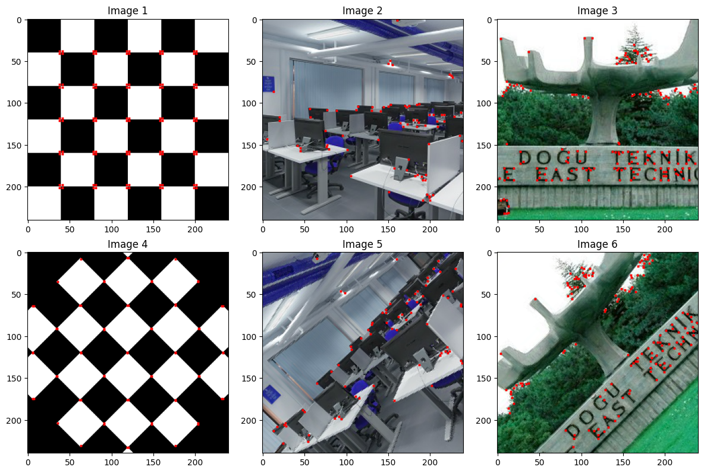

# Harris Corner Detector From Scratch

This repository includes the Naive, and various Fast versions of harris corner detector implemented from scratch. Step by step implementation steps:

1- Naive Formula

2- Naive Formula + NMS

3- Taylor Series Formula + NMS

4- Fast Implementation + NMS - Uniform Weighting

5- Fast Implementation + NMS - Circular Weighting

6- Fast Implementation + NMS - Gaussian Weighting

## Overview

This repository contains a Python implementation of the Harris Corner Detector, a widely used algorithm in computer vision for corner detection. The Harris Corner Detector is particularly useful in image processing and computer vision tasks, where identifying key features, such as corners, is essential.
Harris Corner Detector

The Harris Corner Detector is an edge and corner detection algorithm that was introduced by Chris Harris and Mike Stephens in 1988. It works by analyzing the changes in intensity in different directions, allowing it to identify corners in an image. The algorithm involves calculating the Harris corner response function, which is based on the gradients of intensity in the image.
Implementation

The implementation in this repository is done from scratch in Python, using common libraries such as NumPy for numerical operations. The main steps of the Harris Corner Detector algorithm are implemented, including:
    
    Gradient Calculation: Compute the image gradients using Sobel operators.
    Structure Tensor: Construct the structure tensor based on the gradients.
    Harris Corner Response Function: Calculate the Harris corner response function for each pixel.
    Non-maximum Suppression: Suppress non-maximum values to obtain corner points.
    Thresholding and Corner Selection: Apply a threshold to select the final corner points.

## Example Results

Here are some example results obtained using the Harris Corner Detector on different images:

### Outputs

### Dependencies

    Python 3.x
    NumPy
    Matplotlib (for visualization)

### Acknowledgements 

This implementation is inspired by the original paper: "A Combined Corner and Edge Detector" by Chris Harris and Mike Stephens.
License

This project is licensed under the MIT License - see the LICENSE file for details.
